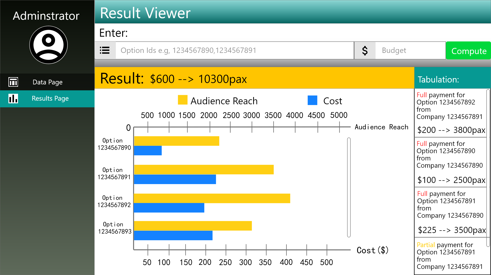
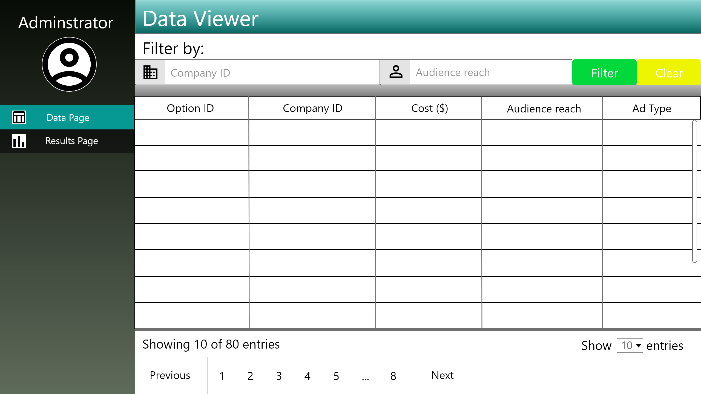

# Wireframe & Justification

This document should help you explain how your user interfaces are designed. You should have a wireframe to give a good overview and some screenshot with simple writeups to justify your designs.

## Wireframe

> This is just an example, please find your own wireframe.

## Justifications

### Justification 1 (Nav Bar)

Image from:
https://www.uihere.com/free-graphics/table-ui-kit-sketch-file-sketch-file-207968

#### Good Points

1. Easy and convenient to navigate around
2. Simple layout for user's to understand
3. Clearly shows what page user is currently on and what other tabs are there

#### Bad Points

1. There is some empty space at the bottom due to the lack of nav tabs.
2. Takes up quite a bit of space, less space for data.

### Justification 2 (Bar chart)

Image from:
https://blog.judge.me/blog/spocket-how-an-entrepreneurs-frustration-made-the-world-of-dropshipping-so-much-easier

#### Good Points

1. Layout of the components are neat
2. Users are able to see an overview of all the types of data there are
3. All alot of different data can be placed within the page

#### Bad Points

1. Too much components and unable to see data as it's too small
2. Users might just want to focus on one component

### Justification 3 (Input boxes)

Image from:
http://www.sengpielaudio.com/calculator-ohm.htm

#### Good Points

1. Lables and units are clearly stated
2. When two values are entered in any of the two boxes, it will compute and fill up the other two boxes with the answer
3. A reset button to clear so user does not need to take their time to cancel the number out and type again

#### Bad Points

1. Aesthetics can be improved
2. The words above the wheel is cramped together which confuses user
