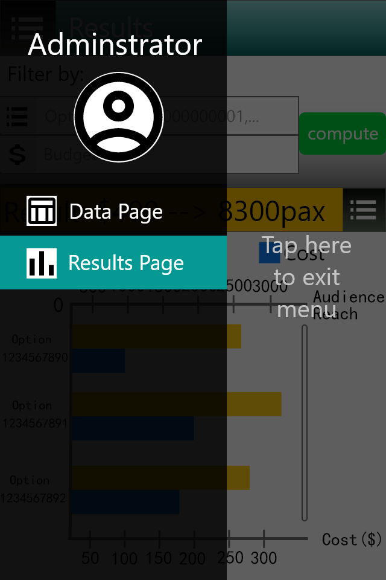

# Wireframe & Justification

This document should help you explain how your user interfaces are designed. You should have a wireframe to give a good overview and some screenshot with simple writeups to justify your designs.

## Wireframe

> This is just an example, please find your own wireframe.

.png) 
 

## Justifications

### Justification 1 (Hamburger menu)

.gif)
Image from:
https://invisioncommunity.com/forums/topic/451084-%F0%9F%92%A1varieties-mobiledesktop-navigation-menu-design/

#### Good Points

1. It saves space
2. Only when the user needs the menu then it will overlay the page
3. There is a search bar to find what page you want to go to

#### Bad Points

1. The button to activate the menu to pop up is at the top left corner, hard for user to reach
2. Users might not know how to exit the hamburger menu when they decide not to nagivate to another page

### Justification 2 (Data graph)

.png)
Image from:
https://www.uxfree.com/crypto-portfolio-sketch-freebie/

#### Good Points

1. Pinpoints the turning points of the graph
2. Graph is big enough for users to see
3. The layout is simple and easy to use

#### Bad Points

1. No indication of values in the x and y axis

### Justification 3 (Input boxes)

.png)
Image from:
[screenshot]

#### Good Points

1. There is a button to clear whatever text is entered
2. Button to click to pick the category
3. Input boxes are clearly labeled

#### Bad Points

1. Maybe the $ sign can be put there in place so user does not have to enter it